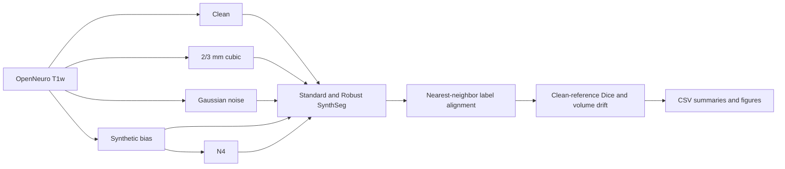
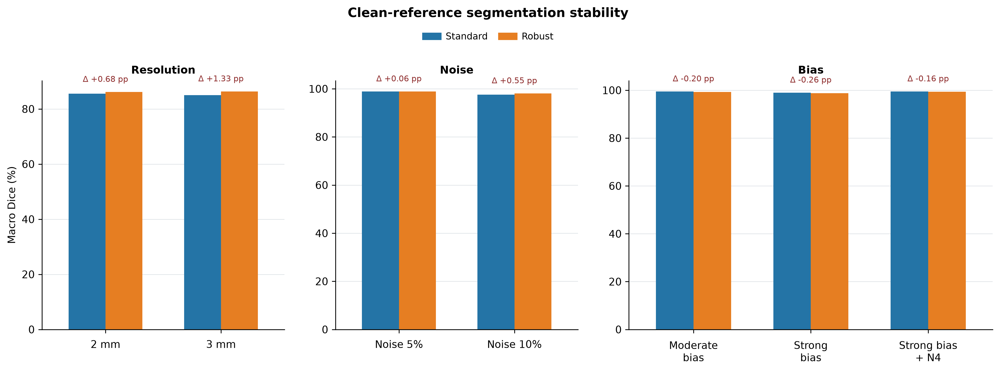
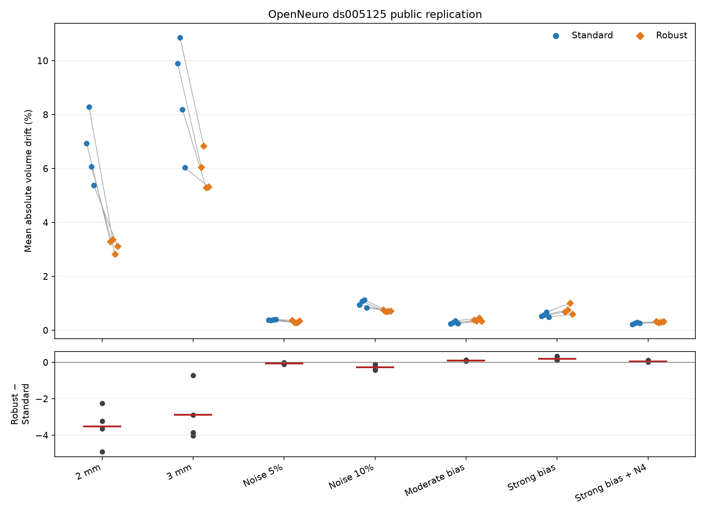

# SynthSeg robustness and stability study

[](https://github.com/mobinamirsharif/synthseg-stability/actions/workflows/validate.yml)

This repository studies how standard SynthSeg and SynthSeg-robust respond to
controlled changes in image resolution, Gaussian noise, and synthetic spatial
intensity non-uniformity. Its primary reproducibility interface targets a
pinned, openly accessible OpenNeuro dataset. Earlier controlled-access work
motivated the study design, but none of its data or derived artifacts are
included in this repository.

> Dice here is agreement with the segmentation produced from the clean image
> by the **same model mode**. It measures segmentation stability, not accuracy
> against manual ground truth.

No manual segmentation ground truth is used in the public experiments.
Internal SynthSeg QC scores are not voxel-wise accuracy measures.

## Repository history note

This repository was rebuilt from a clean root commit on September 25, 2026,
following a data-governance review. Earlier development history was
intentionally discarded because it contained artifacts and implementation
traces associated with controlled-access dataset work. The visible commit
count therefore represents the sanitized publication history, not the full
duration or scope of the project. The current tree contains only material that
is suitable for release with public or synthetic inputs.

## Research question

How stable are SynthSeg outputs when the same T1-weighted anatomy is subjected
to controlled acquisition-relevant perturbations, and does robust mode change
spatial agreement or volumetric drift relative to standard mode?

## Data boundary

The project was initially motivated by experiments conducted on authorized
ADNI imaging data. That earlier work is mentioned only as methodological
provenance. No ADNI images, identifiers, measurements, metrics, QC records,
regional volumes, figures, tables, manifests, or other raw or derived artifacts
are included in this repository. All numerical results and figures distributed
here come exclusively from openly accessible data or synthetic inputs.

## Public dataset

The exploratory public replication is pinned to OpenNeuro
[`ds005125`, snapshot `1.0.0`](https://openneuro.org/datasets/ds005125/versions/1.0.0),
DOI [`10.18112/openneuro.ds005125.v1.0.0`](https://doi.org/10.18112/openneuro.ds005125.v1.0.0).
The dataset is CC0-1.0 and contains 34 three-dimensional T1w scans acquired on a
3 T Siemens Prisma. The experiment uses `sub-01` through `sub-04`, the first
four available T1w participant IDs in lexical BIDS order. This deterministic
rule is fixed in [`config/public_dataset.json`](config/public_dataset.json).

MRI files are downloaded directly from OpenNeuro's public S3 mirror and never
committed. The downloader records source URLs, file sizes, and local checksums.

## Experimental design

Each public image is processed in standard and robust modes. Every perturbed
segmentation is compared with the clean segmentation from the same mode.

| Family | Condition | Exact operation |
|---|---|---|
| Reference | Clean | Original public T1w image |
| Resolution | 2 mm, 3 mm isotropic | `mri_convert --voxsize … --resample_type cubic` |
| Noise | Mild, moderate | sigma = 0.05 or 0.10 × SD(non-zero voxels), seed 42 |
| Intensity | Moderate bias | Controlled multiplicative field, range 0.60–1.40 |
| Intensity | Strong bias | Controlled one-sided field, range 0.45–1.55 |
| Intensity | Strong bias + N4 | Strong field followed by documented N4 |

The bias field is a **controlled synthetic spatial intensity non-uniformity
perturbation**, not a real coil or scanner artifact. Resolution-condition label
maps are aligned to the clean grid with nearest-neighbor interpolation before
Dice calculation. Background is excluded; 32 foreground labels are expected.
Volume summaries include mean and median absolute percentage drift.



## Public replication results

All 64 planned runs completed for four public participants, eight conditions,
and two modes. Every completion marker, input/output checksum, 32-label output,
volume table, and QC table passed the local audit. The table reports cohort
means (`n=4`); Dice is shown as a percentage and differences are Robust −
Standard in percentage points.

| Condition | Standard Dice | Robust Dice | Dice difference | Standard volume drift | Robust volume drift | Drift difference |
|---|---:|---:|---:|---:|---:|---:|
| 2 mm | 85.510% | 86.189% | +0.679 | 6.664% | 3.152% | −3.512 |
| 3 mm | 85.036% | 86.368% | +1.331 | 8.741% | 5.870% | −2.871 |
| Noise 5% | 98.847% | 98.906% | +0.059 | 0.384% | 0.323% | −0.061 |
| Noise 10% | 97.548% | 98.100% | +0.553 | 0.994% | 0.719% | −0.274 |
| Moderate bias | 99.502% | 99.304% | −0.198 | 0.283% | 0.379% | +0.096 |
| Strong bias | 98.994% | 98.733% | −0.261 | 0.561% | 0.762% | +0.202 |
| Strong bias + N4 | 99.500% | 99.335% | −0.164 | 0.258% | 0.310% | +0.053 |

In this small public subset, robust mode was more stable under resolution and
noise perturbations, particularly for volume drift. Standard mode was slightly
more stable under the synthetic bias fields. N4 reduced the instability caused
by strong synthetic bias for both modes in this configuration, but this does
not establish a universal benefit for real scanner bias or other datasets.

The source artifacts are the
[`64-row participant-level table`](results/public/subject_level/results.csv),
[`mode-level aggregate table`](results/public/aggregate/summary.csv), and
[`paired cohort summary`](results/public/aggregate/cohort_summary.csv).





The metric plots show paired-cohort Standard and Robust means, with the mean
Robust − Standard difference annotated for each condition.

## Earlier controlled-access evaluation

The same general perturbation approach was previously tested on authorized
ADNI imaging data. That work informed the public replication design described
here. This repository intentionally retains no ADNI-derived values or files;
the statement above is the complete public record of that evaluation.

## Method provenance

The configurable wrappers preserve the documented command behavior. Standard
SynthSeg passes `--i`, `--o`, `--vol`, `--qc`, and `--threads 1` to
`mri_synthseg`; robust mode adds only `--robust`. Isotropic resampling uses
`mri_convert INPUT OUTPUT --voxsize 2 2 2 --resample_type cubic` or the
corresponding 3 mm values. Low-resolution label maps are returned to their
same-mode clean grid with
`mri_convert TEST OUTPUT --like CLEAN --resample_type nearest`, preserving
discrete labels before Dice calculation. The Dice utility expects 32 foreground
labels and fails on a mismatch unless exploratory override behavior is
explicitly requested.

## Reproducibility environment

The public workflow targets FreeSurfer 8.2.0, SynthSeg 2.0,
SynthSeg-robust 2.0, SimpleITK 2.5.6 / ITK 5.4, and `--threads 1`. Python
dependencies are pinned in `requirements.txt`; CI uses Python 3.11. GPU
execution is not claimed. FreeSurfer installation and licensing are external.

N4 uses an Otsu mask (inside 1, outside 0, 200 bins) and iteration schedule
`[50, 50, 30, 20]`. MRI, segmentations, local work products, and download
manifests are ignored by Git.

## Reproduce

With `mri_convert` and `mri_synthseg` on `PATH`:

```bash
python -m pip install -r requirements.txt
python scripts/download_public_data.py
python -m scripts.run_public_experiment
python scripts/summarize_public_results.py
python scripts/plot_public_results.py
python -m scripts.audit_public_experiment
python -m pytest -q
```

The full run makes 64 SynthSeg calls (4 participants × 8 conditions × 2 modes)
with `--threads 1`; plan runtime accordingly.

## Repository structure

```text
config/                         pinned public dataset manifest
scripts/                        download, perturb, run, measure, and plot
tests/                          synthetic-only tests; no controlled data
results/public/                 public participant and aggregate CSVs
figures/public/                 metric figures and public visual QC
experiments/phase1/             legacy non-participant method artifacts
.github/workflows/validate.yml  CI and privacy checks
```

## Interpretation and limitations

- Clean-reference Dice is stability, not ground-truth accuracy.
- Four public scans form an illustrative subset, not a clinical benchmark.
- Synthetic perturbations do not capture every real acquisition failure.
- Within-mode comparisons do not establish which segmentation is anatomically
  more accurate.
- N4 findings are specific to the controlled field and fixed configuration.
- These exploratory results are not a clinical benchmark and should not be
  interpreted as population-level evidence.

## Data availability, licensing, and citation

Public inputs are obtained from OpenNeuro rather than redistributed. Dataset
`ds005125` is CC0-1.0; that does not automatically license this repository's code.
No repository software license was added because none was previously selected.
FreeSurfer and SynthSeg have separate terms.

- Tarder-Stoll H, Baldassano C, Aly M. *The brain hierarchically represents the
  past and future during multistep anticipation*. OpenNeuro ds005125 v1.0.0.
  <https://doi.org/10.18112/openneuro.ds005125.v1.0.0>
- Billot B, Greve DN, Puonti O, et al. [SynthSeg: Segmentation of brain MRI
  scans of any contrast and resolution without retraining](https://doi.org/10.1016/j.media.2023.102789).
  *Medical Image Analysis*. 2023;86:102789.
- Billot B, Magdamo C, Arnold SE, Das S, Iglesias JE. [Robust machine learning
  segmentation for large-scale analysis of heterogeneous clinical brain MRI
  datasets](https://doi.org/10.1073/pnas.2216399120). *PNAS*. 2023;120(9):e2216399120.

Repository citation metadata are in [`CITATION.cff`](CITATION.cff).
