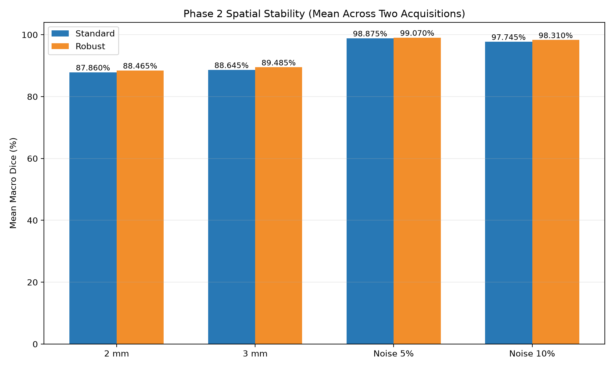
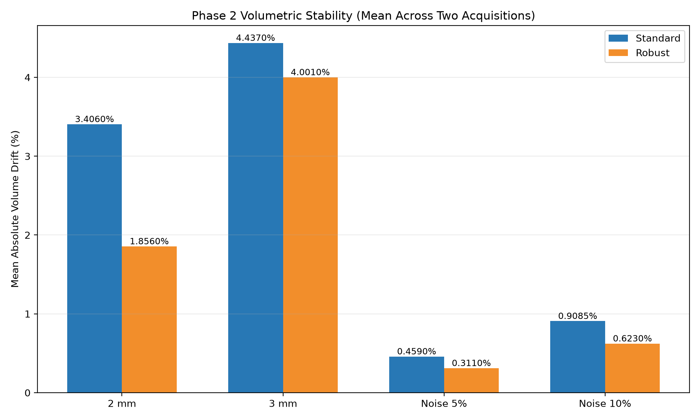

# SynthSeg Stability Experiments on ADNI T1 MRI

[](https://github.com/mobinamirsharif/synthseg-stability/actions/workflows/validate.yml)

This repository evaluates standard SynthSeg and SynthSeg-robust on T1-weighted
MPRAGE MRI from ADNI. The experiments measure how closely segmentations from
controlled degraded inputs agree with a clean-reference segmentation produced
by the **same** SynthSeg mode.

No manual segmentation ground truth was available. Accordingly, Dice values
reported here measure clean-reference spatial agreement (segmentation
stability), not absolute segmentation accuracy. Volume drift measures
volumetric stability relative to the corresponding clean-reference
segmentation.

## Scope and data

- **Phase 1:** clean/reference runs with standard SynthSeg and
  SynthSeg-robust, plus existing fast, autocrop, and parcellation trials.
- **Phase 2:** controlled resolution and Gaussian-noise stress tests on two
  authorized ADNI acquisitions, reported publicly as condition-level means.
- **Phase 3:** controlled synthetic, acquisition-relevant spatial intensity
  non-uniformity on one authorized acquisition, including one N4-corrected
  condition. Numerical outputs from this single-case phase are not published.

The two Phase 2 acquisitions have different native geometries and resolutions
and should not be treated as perfectly matched. Public results are aggregated
across both acquisitions; participant-level derived values are not distributed.

ADNI source images and derived medical-image volumes are **not distributed in
this repository**. To reproduce the full workflow, obtain suitable data
separately through an authorized ADNI access route and supply local input paths
to the scripts. The repository `.gitignore` excludes NIfTI, MGH, and MGZ files
without deleting the local copies.

## Reproducibility

The experiments used FreeSurfer 8.2.0, SynthSeg 2.0, SynthSeg-robust 2.0,
SimpleITK 2.5.6, and ITK 5.4 in WSL Ubuntu 24.04 on a Windows 11 host. Python
dependencies are pinned in `requirements.txt`. The recorded host had an AMD
Ryzen 9 5900HS CPU and approximately 16 GB RAM. Whether SynthSeg used GPU
acceleration was not recorded, so no GPU-execution claim is made. FreeSurfer
commands `mri_convert` and `mri_synthseg` must be available on `PATH`.

The configurable scripts in `scripts/` do not contain personal absolute paths:

```bash
# Isotropic cubic resampling used in Phase 2
python scripts/resample_image.py INPUT.nii.gz OUTPUT_2mm.nii.gz --voxel-size 2
python scripts/resample_image.py INPUT.nii.gz OUTPUT_3mm.nii.gz --voxel-size 3

# Controlled noise: sigma = fraction x SD(non-zero voxels), seed 42
python scripts/generate_gaussian_noise.py INPUT.nii.gz MILD.nii.gz --level mild
python scripts/generate_gaussian_noise.py INPUT.nii.gz MODERATE.nii.gz --level moderate

# Standard SynthSeg
python scripts/run_synthseg.py INPUT.nii.gz SEG.mgz VOLUMES.csv QC.csv

# SynthSeg-robust
python scripts/run_synthseg.py INPUT.nii.gz SEG.mgz VOLUMES.csv QC.csv --robust

# Align each low-resolution segmentation to its same-mode clean reference
python scripts/align_segmentation.py TEST_SEG.mgz CLEAN_SEG.mgz ALIGNED_SEG.mgz

# Compute Dice only after alignment
python scripts/compute_macro_dice.py CLEAN_SEG.mgz ALIGNED_SEG.mgz
```

The wrapper passes `--i`, `--o`, `--vol`, `--qc`, and `--threads 1` to
`mri_synthseg`, adding `--robust` only for robust mode. The resampling wrapper
executes cubic `mri_convert` resampling with `--voxsize 2 2 2` or
`--voxsize 3 3 3`. The alignment wrapper reproduces the command used in the
experiment: `mri_convert TEST OUTPUT --like CLEAN --resample_type nearest`.
Standard outputs must use the clean standard segmentation as `CLEAN`; robust
outputs must use the clean robust segmentation. The Dice utility expects 32
foreground labels by default and fails clearly if that contract is not met;
`--allow-label-count-mismatch` is available for explicitly exploratory use.

Phase 3 inputs and metrics can be reproduced with:

```bash
python scripts/generate_bias_field.py INPUT.nii.gz MODERATE.nii.gz --strength moderate
python scripts/generate_bias_field.py INPUT.nii.gz STRONG.nii.gz --strength strong
python scripts/n4_correct.py STRONG.nii.gz STRONG_N4.nii.gz
python scripts/compute_macro_dice.py CLEAN_SEG.mgz TEST_SEG.mgz
python scripts/compute_volume_drift.py CLEAN_VOLUMES.csv TEST_VOLUMES.csv
```

For the 2 mm and 3 mm conditions, the test segmentation is aligned to the
corresponding same-mode clean-reference grid with nearest-neighbor resampling
before voxel-wise Dice is computed. This preserves discrete label values. The
aligned volumes used for the finalized results remain stored locally but are
excluded from public Git history.

## Robustness Stress Test

### Experimental design

Phase 2 used two authorized ADNI acquisitions (`n=2`) and four controlled
perturbations:

1. 2 mm isotropic cubic resampling.
2. 3 mm isotropic cubic resampling.
3. Mild Gaussian noise: sigma = 0.05 x SD of non-zero voxels.
4. Moderate Gaussian noise: sigma = 0.10 x SD of non-zero voxels.

Gaussian noise generation used random seed 42. For each condition, the
standard output was compared with the clean standard output, and the robust
output with the clean robust output. Macro Dice was calculated over 32
non-background labels. Mean and median absolute percentage volume drift were
calculated over volume metrics shared by each clean/test pair.

### Spatial stability

| Condition | Mean Standard Dice | Mean Robust Dice | Difference (pp) |
|---|---:|---:|---:|
| 2 mm | 87.860% | 88.465% | +0.605 |
| 3 mm | 88.645% | 89.485% | +0.840 |
| Noise 5% | 98.875% | 99.070% | +0.195 |
| Noise 10% | 97.745% | 98.310% | +0.565 |



These values are arithmetic means across the two acquisitions. SynthSeg-robust
had slightly higher mean clean-reference agreement in each tested condition.
This is evidence of relative stability in these exploratory tests, not
ground-truth accuracy or population-level generalizability.

### Volumetric stability

| Condition | Mean Standard drift | Mean Robust drift | Difference (pp) |
|---|---:|---:|---:|
| 2 mm | 3.4060% | 1.8560% | -1.5500 |
| 3 mm | 4.4370% | 4.0010% | -0.4360 |
| Noise 5% | 0.4590% | 0.3110% | -0.1480 |
| Noise 10% | 0.9085% | 0.6230% | -0.2855 |



These values are arithmetic means of the per-acquisition mean absolute volume
drift. SynthSeg-robust had lower aggregate drift in each tested condition, and
resolution degradation produced larger changes than the tested Gaussian-noise
levels. The public aggregate tables are
`results/phase2/aggregate_macro_dice.csv` and
`results/phase2/aggregate_volume_drift.csv`. Participant-level inputs and
regional volume details are not distributed.

## Acquisition-Relevant Intensity Non-Uniformity Experiment

Phase 3 used one authorized acquisition (`n=1`). It is a controlled
**synthetic** experiment intended to approximate acquisition-relevant spatial
intensity non-uniformity; it is not a real scanner or coil-failure experiment.

- **Moderate bias:** multiplicative field approximately 0.60 to 1.40.
- **Strong one-sided bias:** multiplicative field approximately 0.45 to 1.55.
- **Strong bias + N4:** the strong-bias image followed by N4 correction.

Both modes remained highly stable in the tested case. N4 effects were
mode- and metric-dependent, so this experiment does not show that N4
universally improves SynthSeg outputs. Because this phase was based on one
acquisition, exact numerical results, runtimes, and figures are retained
privately rather than published. The qualitative observation is exploratory
and should not be generalized.

## Limitations

- Phase 2 includes only two acquisitions (`n=2`); Phase 3 includes one
  (`n=1`).
- No manual segmentation ground truth was available. Dice is agreement with
  the clean segmentation from the same mode, not absolute accuracy.
- Internal SynthSeg QC scores are not voxel-wise accuracy measures.
- The two Phase 2 acquisitions have different native image geometries and
  resolutions.
- Gaussian noise and bias fields are controlled synthetic degradations.
- The bias-field test is acquisition-relevant but is not evidence from a real
  scanner or coil failure.
- N4 findings should not be generalized beyond the tested acquisition and
  configuration.
- These exploratory experiments should not be interpreted as a benchmark.

## References

- Billot B, Greve DN, Puonti O, et al. [SynthSeg: Segmentation of brain MRI
  scans of any contrast and resolution without retraining](https://doi.org/10.1016/j.media.2023.102789).
  *Medical Image Analysis*. 2023;86:102789.
- Billot B, Magdamo C, Arnold SE, Das S, Iglesias JE. [Robust machine learning
  segmentation for large-scale analysis of heterogeneous clinical brain MRI
  datasets](https://doi.org/10.1073/pnas.2216399120).
  *Proceedings of the National Academy of Sciences*. 2023;120(9):e2216399120.

See `CITATION.cff` for repository citation metadata.

## Repository contents

- `scripts/`: configurable preprocessing, SynthSeg, N4, and metric utilities.
- `tests/`: unit and consistency tests that use synthetic arrays and committed
  aggregate artifacts only.
- `figures/`: aggregate-only Phase 2 figures.
- `results/`: aggregate-only Phase 2 CSV result artifacts.
- `experiments/phase1/`: non-participant Phase 1 artifacts and provenance notes.

Participant-level derived results, Phase 3 numerical artifacts, QC tables,
volume tables, source images, and segmentations remain in ignored local
directories and are not part of the public tree.
